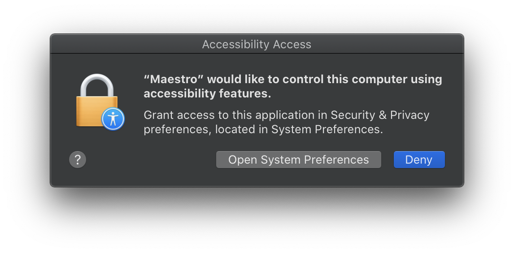

# Maestro

## About

*Take control of your music*

Maestro is a cross-platform [Electron](https://www.electronjs.org/) application that wraps a variety of web audio players, adding support for global media key handling as well as a mini mode player.  Currently supported web-based audio players include:

* iHeartRadio
* SiriusXM
* TuneIn Radio
* YouTube Music

Tested on:

* MacOS Catlina
* Ubuntu 20.10


### MacOS Accessibility

In order to control Maestro using media keys on MacOS, it is necessary to allow Maestro to control the computer using media keys.  When it is first determined that this must be completed, the user will be prompted to turn on accessibility:


Upon choosing `Turn On Accessibility` MacOS will prompt to `Open System Preferences`.



Choose `Open System Preferences`, unlock the preferences and make sure that Maestro is selected in the list:


**After configuring system preferences, Maestro must be restarted in order for media keys to work properly.**

## Project Development

### Setup

Clone the Git repository and download required modules using

```
yarn install
```

### Compiles and hot-reloads for development
```
yarn electron:serve
```

In addition, it is possible to start and debug the application from within Visual Studio Code:


### Compiles and minifies for production
```
yarn electron:build
```

## Known Issues

* Google music services fail during login due to Mitm protection.  See [this](https://developers.google.com/identity/protocols/oauth2/native-app) for more information.

## License

[Apache 2.0](https://www.apache.org/licenses/LICENSE-2.0)

## Attributions
* Icon made from <a href="http://www.onlinewebfonts.com/icon">Icon Fonts</a> is licensed by CC BY 3.0
* Bootstrap Theme from https://bootswatch.com/

